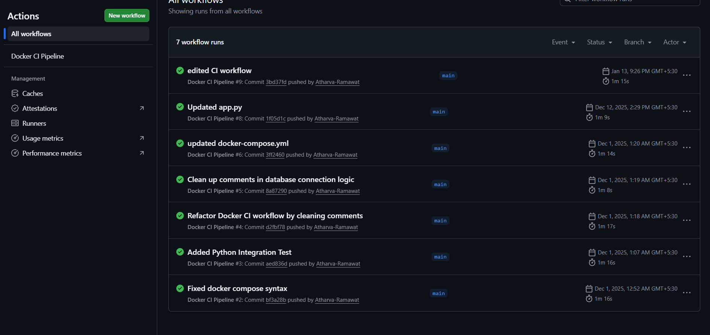

# Flask MySQL CI Pipeline

   

A robust, containerized two-tier application integrating a **Flask** backend with a **MySQL** database. This project demonstrates modern DevOps practices with a fully automated **GitHub Actions** Continuous Integration (CI) pipeline.

---

## 📖 Project Overview

This repository showcases a microservices architecture where the application logic (Flask) and data persistence (MySQL) are decoupled and containerized. The primary focus is on **automation** and **reliability**: ensuring that every code change is automatically built, tested, and verified before deployment.

### Key Features
* **Two-Tier Architecture:** Seamless integration between Flask (Application Layer) and MySQL (Data Layer).
* **Containerization:** Fully isolated environments using Docker.
* **Automated CI Pipeline:** Triggers builds on every push to `main` via GitHub Actions to ensure code integrity.
* **Scalability:** Designed to be easily orchestrated with tools like Kubernetes.

---

## ⚙️ CI/CD Pipeline Workflow

The core of this project is the **GitHub Actions** workflow, which automates the build process.

**Workflow Stages:**
1.  **Source Checkout:** Retrieves the latest commit.
2.  **Environment Setup:** Initializes the build environment.
3.  **Docker Build:** Compiles the Docker images for Flask and MySQL.
4.  **Verification:** Validates the build status.

### Pipeline Visualization
Below is a capture of the GitHub Actions workflow execution, validating the successful integration of the latest build.


*(Fig. 1: Successful execution of the CI pipeline in the GitHub Actions tab)*

---

## 🛠️ Tech Stack

| Component | Technology | Description |
| :--- | :--- | :--- |
| **Backend** |  | Python-based lightweight web framework. |
| **Database** |  | Relational database management system. |
| **Containerization** |  | Used to package the application and database. |
| **CI/CD** |  | Automates the build and test workflows. |

---

## 🚀 Getting Started

Follow these instructions to set up the project locally.

### Prerequisites
* [Docker](https://docs.docker.com/get-docker/) installed on your machine.
* Git installed.

### Installation

1.  **Clone the repository**
    ```bash
    git clone [https://github.com/Atharva-Ramawat/Flask-mysql-CI-pipeline.git](https://github.com/Atharva-Ramawat/Flask-mysql-CI-pipeline.git)
    cd Flask-mysql-CI-pipeline
    ```

2.  **Build the Docker Images**
    ```bash
    docker-compose build
    ```
    *(Or `docker build ...` if you are not using compose)*

3.  **Run the Application**
    ```bash
    docker-compose up -d
    ```

---

## 👨‍💻 Author

**Atharva Ramawat**
* [GitHub Profile](https://github.com/Atharva-Ramawat)

---

*This project is for educational purposes to demonstrate CI/CD, Flask, and Docker workflows.*